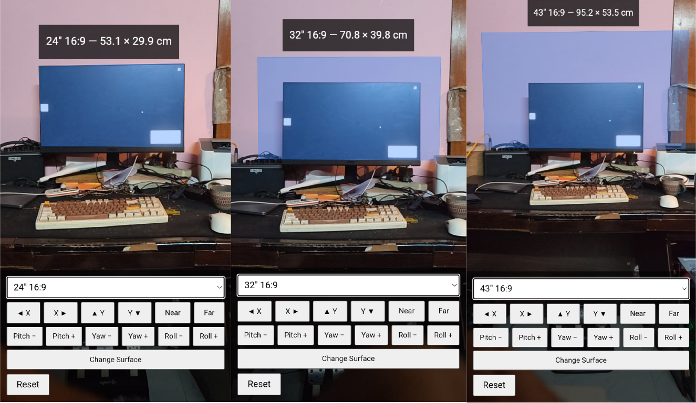

# AR Display Size Visualizer

A browser-based augmented reality tool for previewing the true physical size of a monitor or TV before buying one. Point a phone's camera at a desk or wall and view a life-size outline of any listed display size, positioned and scaled to match the real space.

**Live:** https://nirobnabil.github.io/DisplayScaleAR/

## Demo

## Try It

1. Open the link above on an Android phone in **Chrome**.
2. Tap **Start AR** and allow camera access.
3. Point the camera at a desk, floor, or wall until a surface is detected, then tap to place a rectangle at that spot.
4. Choose a monitor or TV size from the dropdown.

No installation or account is required. The page requires Chrome for Android on a device that supports Chrome's AR mode (ARCore); other browsers and iOS are not supported.

## What It Does

- Renders a flat, correctly proportioned rectangle in AR, sized from a diagonal-inch and aspect-ratio preset — the same numbers used on a spec sheet.
- Lets a size be swapped after placement without re-placing the rectangle.
- Locks a placed rectangle to its surface to prevent accidental repositioning, with an explicit action to release the lock and choose a new surface.
- Provides full manual alignment: translation on all three axes and independent pitch/yaw/roll rotation, so the rectangle can be lined up precisely against a monitor already on the desk. Each control supports a single tap for a small adjustment or a held press for continuous movement.

## Preset Sizes

| Category | Sizes |
|---|---|
| PC Monitors 16:9 | 24", 27", 32" |
| PC Monitors 16:10 | 24", 27", 32" |
| Ultrawide 21:9 | 29", 34", 38" |
| Super Ultrawide 32:9 | 49", 57" |
| TVs 16:9 | 43", 55", 65", 75", 85" |

Sizes are computed from a fixed formula (diagonal inches and aspect ratio → width/height in meters), not a lookup table. See `presets.js`.

## Running Locally

The hosted link above is sufficient for normal use. Running the project locally is only needed for development or offline use:

1. Generate a self-signed certificate: `node generate-cert.js`
2. Start the server: `node server.js` (serves the project on port `8443` over HTTPS)
3. On a phone connected to the same network, open `https://<host-machine-ip>:8443` in Chrome and accept the certificate warning.

WebXR requires a secure context, which a self-signed certificate on a LAN address satisfies but plain HTTP does not.

## Technical Notes

- Static site: `index.html`, `app.js`, `presets.js`, using [Three.js](https://threejs.org/) for rendering and the browser's [WebXR](https://immersiveweb.dev/) API (`immersive-ar` session with hit-testing) for camera and surface detection. No framework, no build step.
- `server.js` is a minimal Node `https` static file server used only for local development.
- `node test.js` validates `presetToMeters` against known reference values. The AR/camera behavior itself cannot be tested outside a physical ARCore device.
- Built with AI assistance. The original specification, `ar-display-size-visualizer-spec.md`, is included for reference and may not exactly match the current implementation.

## Scope

This is a personal utility, not a product: no accounts, tracking, or analytics, no realistic 3D monitor models, and no support for portrait displays or multiple simultaneous placements.

## License

Free to use, copy, and modify.
